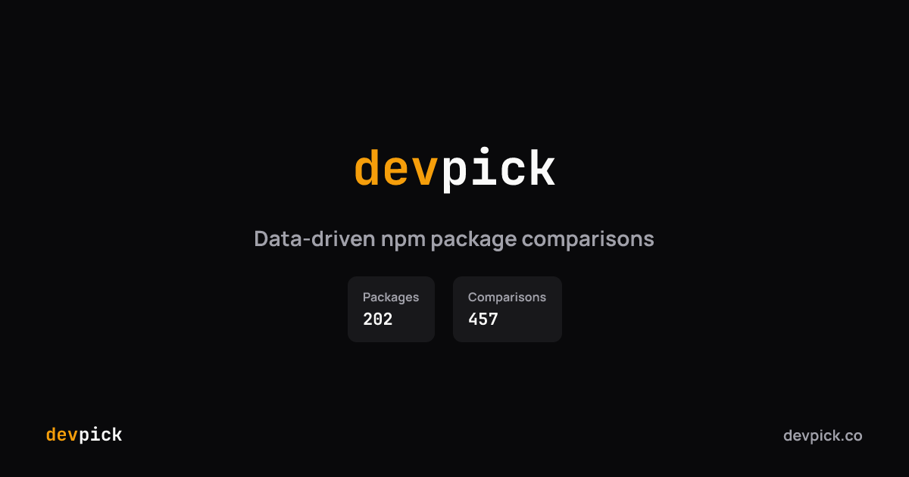
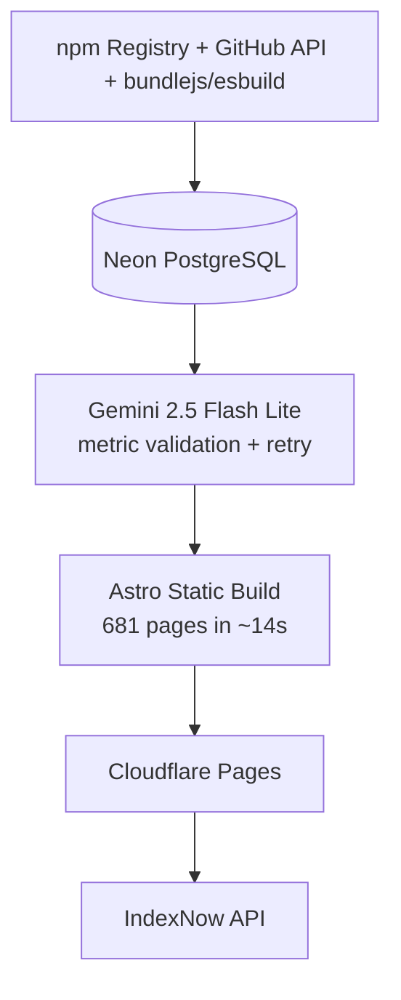
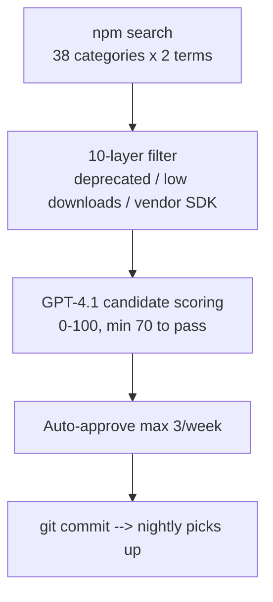

# devpick.co

**Data-driven npm package comparisons. Real stats, no guesswork.**

[Live Site](https://devpick.co)

## What is DevPick?

DevPick helps developers choose between npm packages by providing side-by-side comparisons with real data: weekly downloads, bundle sizes, GitHub activity, maintenance scores, and AI-generated verdicts with 12-16 weighted criteria per comparison.

## Stats

| Metric | Value |
|--------|-------|
| Tracked packages | 198 |
| AI-generated comparisons | 433 |
| Categories | 45 |
| Static pages | 681 |
| Build time | ~14s (with OG cache) |
| Full AI regeneration cost | ~$0.11 |

## Tech Stack

| Layer | Technology |
|-------|-----------|
| Framework | Astro 5 + React 19 (Islands) |
| Styling | Tailwind CSS v4 |
| Database | Neon PostgreSQL (serverless) |
| ORM | Drizzle ORM |
| AI (content) | Gemini 2.5 Flash Lite (via OpenRouter) |
| AI (evaluation) | GPT-4.1 (via OpenRouter) |
| Search | Fuse.js (client-side) |
| OG Images | Satori + resvg-js |
| Hosting | Cloudflare Pages |
| CI/CD | GitHub Actions |

## Architecture

**Nightly Pipeline** (03:00 UTC daily)

**Weekly Discovery** (Monday 06:00 UTC)

## Notable Engineering Decisions

- **Fully autonomous growth**: Weekly pipeline discovers, evaluates (GPT-4.1), and approves new packages without human intervention. The site grows itself.
- **Multi-tier AI routing**: High-profile packages (React, Vue, Tailwind) get enriched context injection. Evaluation uses a separate, more expensive model than content generation.
- **4-tier bundle size fallback**: bundlejs API → bundlephobia → local esbuild (browser) → local esbuild (node) → node_modules install size. Never fails silently.
- **AI metric validation**: Regex-based fact-checking layer catches hallucinated stats in AI output. Incorrect claims trigger a correction retry before saving.
- **Content-hash OG cache**: Satori-generated PNG images are cached by content hash. Build time dropped from ~227s to ~14s.
- **Budget guards**: $5/day for nightly pipeline, $1/day for weekly discovery. `BudgetExceededError` halts gracefully.
- **Build-time query memoization**: `once()` wrapper reduces 77 DB queries to ~12 across 681 pages.

## Source Code

Source code is in a private repository. This repo serves as a public project overview.

## Author

**Mehmet Aras** — Senior Frontend Engineer
- [arasmehmet.com](https://arasmehmet.com)
- [LinkedIn](https://linkedin.com/in/arasmehmet7)
